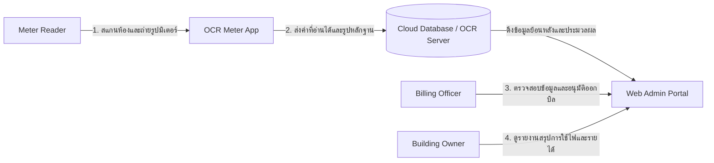

# P02 — Stakeholder, Context and Scope

## Stakeholder Map

| Stakeholder | Role / interest | Goal | Concern / conflict |
|---|---|---|---|
| Meter Reader (พนักงานจดมิเตอร์) | ผู้เดินบันทึกข้อมูลดัชนีมิเตอร์ไฟฟ้าตามห้องพักหน้างาน | สแกนและบันทึกเลขมิเตอร์ได้รวดเร็ว ถูกต้อง โดยไม่ต้องพกกระดาษปากกาหรือพิมพ์ข้อมูลเอง | แสงสะท้อนจากฝาครอบบังตัวเลข, สัญญาณเน็ตอับตามซอกตึก, ตัวเลขจานหมุนก้ำกึ่งเลื่อนหลักอ่านยาก |
| Billing Officer (ฝ่ายบัญชี/ออกบิล) | ผู้ตรวจสอบตัวเลขและคำนวณยอดเพื่อออกบิลค่าใช้จ่ายประจำเดือน | ได้รับข้อมูลตัวเลขมิเตอร์ที่แม่นยำเพื่อออกบิลได้ตรงเวลา | พนักงานจดเลขผิดหรือคีย์สลับจนออกบิลพลาด ทำให้เสียเวลายกเลิกและออกบิลใหม่ |
| Building Owner (เจ้าของหอพัก) | ผู้ควบคุม ติดตาม และตรวจสอบรายได้กับประสิทธิภาพพลังงานภาพรวม | ติดตามรายได้ค่าไฟและมีหลักฐานรูปถ่ายย้อนหลังสำหรับตรวจสอบ | เกิดข้อพิพาทกับผู้เช่าเรื่องค่าไฟ หรือข้อมูลสูญหายและทุจริต |
| Tenant (ผู้เช่าห้องพัก) | ผู้ใช้งานไฟฟ้าและผู้รับภาระค่าใช้จ่ายตามบิลประจำเดือน | ได้รับบิลค่าไฟที่ถูกต้องตรงตามการใช้งานจริง และมีรายละเอียดดัชนีมิเตอร์ชัดเจน | ค่าไฟแพงเกินจริงจากระบบหรือคนจดผิด และขาดความโปร่งใสในการเรียกเก็บเงิน |
| System Administrator | ผู้ดูแลเสถียรภาพระบบ สิทธิ์ผู้ใช้งาน และความปลอดภัยฐานข้อมูล | ระบบหลังบ้านและฐานข้อมูลทำงานได้ต่อเนื่อง ปลอดภัย และเชื่อถือได้ | ความถูกต้องของข้อมูลจาก OCR และการจัดการสิทธิ์เข้าถึงข้อมูลส่วนบุคคลของผู้เช่า |

## System Context

## Scope
In scope
Mobile Camera UI พร้อม Bounding Box และ Anti-Reflection Guide
Image Pre-processing Engine เช่น Perspective Transform และ Image Enhancement
OCR Meter Reader Model สำหรับอ่านตัวเลข 5 หลักจากมิเตอร์จานหมุน
Local Validation Logic สำหรับตรวจจับค่าผิดปกติ
Offline Data Storage และการ Sync ข้อมูลอัตโนมัติเมื่อมีอินเทอร์เน็ต
Web Admin Portal สำหรับจัดการข้อมูลห้องพักและดูรายงาน
การแจ้งเตือนความผิดปกติของค่ามิเตอร์ทันทีที่หน้างาน
การจัดเก็บรูปภาพหลักฐานและประวัติการอ่านมิเตอร์ย้อนหลัง
รายงานสรุปยอดการใช้ไฟฟ้ารายเดือนรายห้องและภาพรวมทั้งอาคาร
Out of scope
ระบบพิมพ์บิลหรือใบเสร็จรับเงินโดยตรง
ระบบรับชำระเงินออนไลน์ (Payment Gateway)
ระบบส่ง SMS, Email หรือ LINE แจ้งบิลถึงผู้เช่าโดยตรง
การเชื่อมต่อกับ Smart Meter หรือ IoT Meter
ระบบบัญชีการเงินและภาษี
ระบบบริหารสัญญาเช่าหรือการจัดการผู้เช่า

Constraints and Ethics/Privacy
| Constraint / issue                 | Impact                                | Response                                                        |
| ---------------------------------- | ------------------------------------- | --------------------------------------------------------------- |
| แสงสะท้อนจากฝาครอบมิเตอร์          | OCR อ่านค่าตัวเลขผิดพลาด              | ออกแบบ UI ให้เอียงกล้อง 15–30 องศา และใช้ Perspective Transform |
| พื้นที่อับสัญญาณอินเทอร์เน็ต       | ไม่สามารถส่งข้อมูลขึ้น Cloud ได้ทันที | ใช้สถาปัตยกรรม Offline-first และ Sync ภายหลัง                   |
| ตัวเลขก้ำกึ่งช่วงเปลี่ยนหลัก       | AI อาจอ่านตัวเลขผิด                   | ใช้ Human-in-the-loop ให้พนักงานตรวจสอบและยืนยันก่อนบันทึก      |
| มิเตอร์เก่าหรือเลขจาง              | OCR ไม่สามารถอ่านข้อมูลได้            | รองรับ Manual Key-in โดยพนักงาน                                 |
| ข้อมูลส่วนบุคคลของผู้เช่า          | ความเสี่ยงด้านความเป็นส่วนตัว         | ใช้ระบบ Login และ Role-Based Access Control (RBAC)              |
| การเข้าถึงข้อมูลโดยไม่ได้รับอนุญาต | ข้อมูลรั่วไหลหรือถูกแก้ไข             | กำหนดสิทธิ์การใช้งานและบันทึก Audit Log                         |
| ข้อมูลสูญหายระหว่างการซิงค์        | ความถูกต้องของข้อมูลลดลง              | ใช้ระบบตรวจสอบความสมบูรณ์ของข้อมูลและสำรองข้อมูล                |
